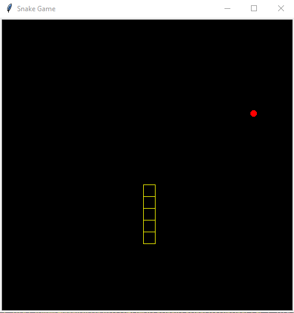

<h1>
  Snake-Game
</h1>
<h3>
  Summery 
</h3>

  The Snake game is a nostalgic arcade classic, featuring a snake that players control to navigate a grid-based environment. The objective is to eat randomly placed food, which causes the snake to grow longer. As the snake grows, maneuvering becomes increasingly challenging as players must avoid collisions with the snake's own body or, depending on the rules, the boundaries of the play area. The game loops seamlessly with wrapping edges, adding complexity. Players direct the snake's movement using simple controls (e.g., arrow keys), making it accessible yet addictive. It fosters quick thinking and strategy as players anticipate their moves in a progressively constrained space. Developed using Python’s turtle library, the game is also an excellent beginner-friendly project for learning programming, incorporating logic, randomization, and real-time event handling.
  

<h3>
  The output is show as fallow:-
</h3>

<h3>
  The output shows like this after playing the game for some time:-
</h3>

